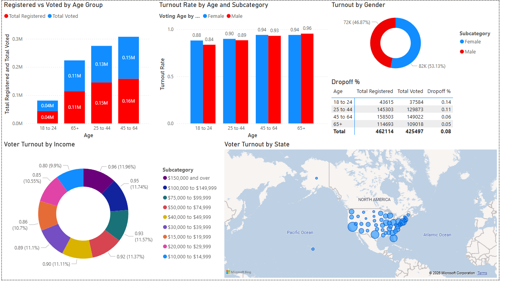

# voting-dashboard
Voting Trends Dashboard Analyzing age, gender, state, and income level data from the 2020 election. Data source is from the UF Election Lab. 

## Overview
This dashboard analyzes voter trends by age, gender, and state using public census and election data.

## Tools Used
- Power BI Desktop
- SQL & Excel (data prep)
- Public Census & Election datasets

## Dashboard Preview

## Full Report
Download the full dashboard PDF here: [Voter Dashboard PDF](Voter Dashboard.pdf)

## Key Insights
- Voter turnout increases sharply after age 24
- Dropoff rate from registered to voted is much higher for ages 18-44
- No correlation between income and turnout rate visable
